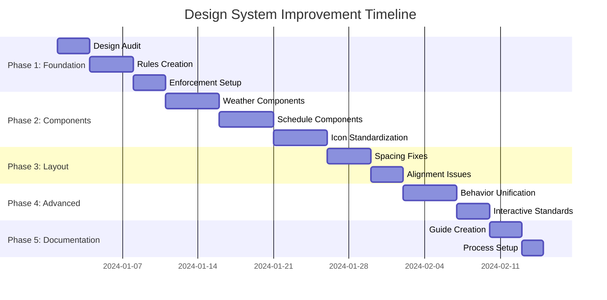

# Design System Improvement Plan
## Implementing Professional UI Design Principles

### Overview
This document outlines a comprehensive plan to improve the DragonWorldsHK2027 app's design consistency and user experience based on proven UI design principles. The goal is to achieve a "calmer, more professional" interface through global consistency rather than local optimizations.

---

## Key Design Principles (From Research)

### The Two Pillars of Good Design
1. **Alignment** - Elements positioned consistently across the interface
2. **Consistency** - Similar elements looking and behaving the same way

### Critical Rules for Implementation
- **Global consistency trumps local optimizations**
- **Use component libraries as-is** - don't customize for each use case
- **Two font weights only** (regular + semibold)
- **Two text colors only** (primary + secondary)
- **Icon weights must match adjacent text**
- **Create project-specific design rules** to eliminate repetitive decisions

---

## Current State Analysis

### Strengths
✅ **Excellent foundation**: Comprehensive design system in `src/constants/theme.ts`
✅ **iOS component library**: Well-structured IOSButton, IOSText, IOSCard components
✅ **Documentation**: Detailed `design-guidelines.md` with Apple HIG compliance
✅ **Some consistent usage**: Components like `DayCard.tsx` properly use design system

### Critical Issues Found
❌ **49 components with hardcoded colors** instead of theme constants
❌ **Inconsistent component library usage** - some bypass IOSCard/IOSText entirely
❌ **Multiple font weights violating 2-weight rule**
❌ **Multiple text colors violating 2-color rule**
❌ **Icon weight mismatches** with adjacent text
❌ **No enforcement mechanism** for design system compliance

---

## Implementation Plan

## Phase 1: Foundation & Rules (Week 1-2)

### 1.1 Design System Audit
**Create automated tools to identify inconsistencies**

```bash
# Create audit script
./scripts/design-audit.js
```

**Deliverables:**
- Component usage audit report
- List of all hardcoded colors/styles
- Icon weight mismatch inventory
- Font weight usage analysis

### 1.2 Project-Specific Design Rules
**Create DESIGN_IMPLEMENTATION_RULES.md with specific patterns**

**Typography Rules:**
- **Primary weight**: `fontWeight: '400'` (regular)
- **Secondary weight**: `fontWeight: '600'` (semibold)
- **No other weights allowed** in component styles

**Color Rules:**
- **Primary text**: `colors.text` only
- **Secondary text**: `colors.textSecondary` only
- **No hardcoded color values** in component StyleSheets
- **All colors must reference theme constants**

**Icon Rules:**
- **Match adjacent text weight**: Regular icons with regular text, semibold with semibold
- **Consistent sizing**: 16px, 20px, 24px only
- **Stroke width**: 2px for regular, 2.5px for semibold equivalent

### 1.3 Enforcement Tools
**ESLint rules for design system compliance**

```javascript
// .eslintrc.js additions
rules: {
  'no-hardcoded-colors': 'error',
  'require-theme-imports': 'error',
  'consistent-spacing-units': 'warn'
}
```

**Pre-commit hooks:**
- Check for hardcoded colors
- Verify theme constant usage
- Validate component patterns

---

## Phase 2: Component Library Standardization (Week 3-5)

### 2.1 High-Priority Component Fixes

**Weather Components (Critical - User-Facing)**
- `NauticalWeatherCard.tsx` - Remove hardcoded colors, use theme
- `WeatherLayerControls.tsx` - Standardize to IOSCard pattern
- `MarineWarningPanel.tsx` - Fix icon weight mismatches

**Schedule Components**
- `DayCard.tsx` - Already good, use as reference pattern
- `ActivityItem.tsx` - Align with DayCard consistency
- `EventSelector.tsx` - Standardize selection states

**Navigation Components**
- All tab bar icons - standardize weight matching
- Header components - consistent spacing/alignment

### 2.2 Icon Weight Standardization

**Before (Incorrect):**
```tsx
// Thin icon with bold text
<Wind size={24} strokeWidth={1.5} />
<Text style={{fontWeight: '600'}}>Wind Speed</Text>
```

**After (Correct):**
```tsx
// Icon weight matches text weight
<Wind size={24} strokeWidth={2.5} />
<IOSText weight="semibold">Wind Speed</IOSText>
```

**Implementation:**
- Audit all Lucide icons for stroke weight
- Create icon weight helper function
- Update all 78+ components systematically

### 2.3 Typography Simplification

**Current Issue:**
```tsx
// Multiple weights used inconsistently
fontWeight: '400' | '500' | '600' | '700' | 'bold' | 'semibold'
```

**Simplified System:**
```tsx
// Only two weights allowed
type AllowedWeight = '400' | '600';

// Implementation in IOSText
const weights = {
  regular: '400',
  semibold: '600'
}
```

---

## Phase 3: Layout & Spacing Consistency (Week 6-7)

### 3.1 Spacing Standardization

**Replace all hardcoded values:**
```tsx
// Before
padding: 12,
margin: 15,
marginTop: 20,

// After
padding: spacing.md,    // 16px
margin: spacing.sm,     // 8px
marginTop: spacing.lg,  // 24px
```

### 3.2 Component Alignment

**Fix alignment issues identified:**
- Navigation sidebar icon alignment
- Item count positioning consistency
- Button placement standardization
- Card content alignment

### 3.3 Card System Unification

**Ensure all cards use IOSCard:**
```tsx
// Before - Custom styling
<View style={[styles.customCard, {...}]}>

// After - Consistent system
<IOSCard variant="elevated" style={styles.additionalStyles}>
```

---

## Phase 4: Advanced Consistency (Week 8-9)

### 4.1 Component Behavior Unification

**Loading States:**
- Standardize skeleton loaders
- Consistent spinner usage
- Unified error states

**Animations:**
- Use existing `reanimatedWrapper` consistently
- Standardize transition timings
- Consistent touch feedback

### 4.2 Interactive Element Standards

**Touch Targets:**
- Minimum 44px x 44px (Apple HIG)
- Consistent active states
- Unified haptic feedback

**Button States:**
- Standard disabled opacity (0.4)
- Consistent pressed states
- Unified loading indicators

---

## Phase 5: Documentation & Maintenance (Week 10)

### 5.1 Developer Documentation

**Create comprehensive guides:**
- `COMPONENT_USAGE_GUIDE.md`
- `DESIGN_PATTERNS.md`
- `COMMON_MISTAKES.md`

**Update existing docs:**
- Enhance `CLAUDE.md` with enforcement rules
- Update `design-guidelines.md` with implementation details

### 5.2 Long-term Maintenance

**Automated checks:**
- CI/CD design system validation
- Component usage reports
- Regular consistency audits

**Team processes:**
- Design review checkpoints
- Component library governance
- Regular design system updates

---

## Success Metrics

### Quantitative Goals
- **0 hardcoded colors** in component styles
- **100% IOSCard/IOSText usage** for respective UI elements
- **2 font weights maximum** across entire app
- **<5 second** design system compliance check runtime

### Qualitative Goals
- **Visual calmness** - Less cognitive load when scanning interface
- **Professional polish** - Consistent, intentional appearance
- **Developer efficiency** - Clear patterns, fewer design decisions
- **Maintainable codebase** - Centralized styling, easy updates

---

## Implementation Timeline



---

## Risk Mitigation

### Technical Risks
- **Breaking changes**: Implement gradually with feature flags
- **Performance impact**: Batch style updates, test on devices
- **Regression issues**: Comprehensive visual regression testing

### Process Risks
- **Developer resistance**: Clear documentation and training
- **Timeline pressure**: Prioritize high-impact changes first
- **Scope creep**: Stick to consistency rules, avoid feature additions

---

## Expected Outcomes

After implementing this plan, the DragonWorldsHK2027 app will:

1. **Feel significantly more professional** with subtle but impactful consistency improvements
2. **Reduce cognitive load** for users through predictable interface patterns
3. **Accelerate development** with clear design system guidelines
4. **Improve maintainability** through centralized styling and documentation
5. **Create foundation** for future feature development with built-in consistency

The changes will be subtle to users but transformative for the overall user experience - exactly what distinguishes good design from bad design according to the research principles.